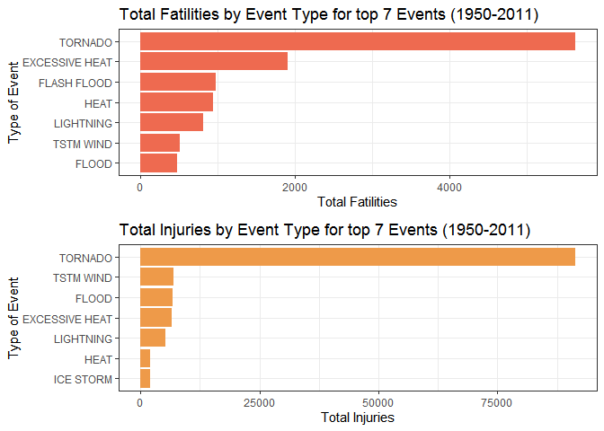
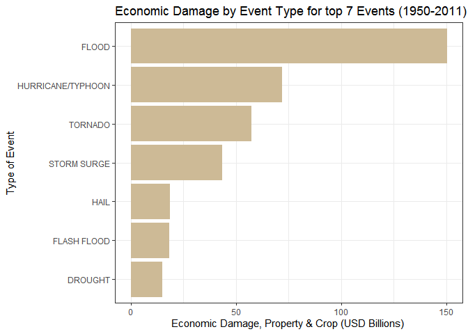

<br>

### 1. Introduction:

Storm disasters are a regular occurence in the United States of America (US). National Oceanic and Atmospheric Adminsitration (NOAA) is an American sceintific agency within the Unites States Department of Commerce that focusses on the conditions of the oceans, major waterways and the atmosphere. NOAA has a database of disasters that have occured in the US. This study is an attempt to analyze this database and figure out which disasters are most detrimental to human health and economy.

***

### 2. Synopsis:

The storm disaster dataset spans from 1950 to 2011. The dataset has been first downloaded and processed and then analysed to figure out the following:
    
* Top 7 disasters that have caused maximum fatiliites from 1950 to 2011
* Top 7 disasters that have caused maximum injuries from 1950 to 2011
* Top 7 disasters that have caused maximum economic damage (property and crop) from 1950 to 2011

Barcharts have been created for visualizing the results. The following sections describe the process in detail.

***

### 3. Data Processing:

* **Loading necessary libraries**: The following three libraries have been used for analysis:
    * `data.table`
    * `ggplot2`
    * `gridExtra`


```r
library(data.table)
library(ggplot2)
library(gridExtra)
```
<br>

* **Examining the Data**: As a first step only the first 10 rows of the data are read to visualize the column names and the variable types of different columns. The data has been directly loaded from the URL without any intermediary steps.


```r
info_temporary <- fread(input='https://d396qusza40orc.cloudfront.net/repdata%2Fdata%2FStormData.csv.bz2', 
                        nrows=10)
print(colnames(info_temporary))
```

```
 [1] "STATE__"    "BGN_DATE"   "BGN_TIME"   "TIME_ZONE"  "COUNTY"    
 [6] "COUNTYNAME" "STATE"      "EVTYPE"     "BGN_RANGE"  "BGN_AZI"   
[11] "BGN_LOCATI" "END_DATE"   "END_TIME"   "COUNTY_END" "COUNTYENDN"
[16] "END_RANGE"  "END_AZI"    "END_LOCATI" "LENGTH"     "WIDTH"     
[21] "F"          "MAG"        "FATALITIES" "INJURIES"   "PROPDMG"   
[26] "PROPDMGEXP" "CROPDMG"    "CROPDMGEXP" "WFO"        "STATEOFFIC"
[31] "ZONENAMES"  "LATITUDE"   "LONGITUDE"  "LATITUDE_E" "LONGITUDE_"
[36] "REMARKS"    "REFNUM"    
```
<br>

* **Figuring out columns to analyze**: Given the requirements, the relevant columns are:
    * `EVTYPE` : Type of Diaster
    * `FATALITIES`: Number of fatalities resulting from the disaster 
    * `INJURIES`: Number of injuries resulting from the disaster
    * `PROPDMG`: Monetary value of damage to properties
    * `PROPDMGEXP`: Exponential power of the monetary damage to properties (base 10)
    * `CROPDMG`: Monetary value of damage to crops
    * `CROPDMGEXP`: Exponential power of the monetary damage to crops (base 10)

Detailed information about the column headers can be obtained from [Storm Data Documentation](https://d396qusza40orc.cloudfront.net/repdata%2Fpeer2_doc%2Fpd01016005curr.pdf)


```r
columns_to_keep <- c('EVTYPE', 'FATALITIES', 'INJURIES', 'PROPDMG', 'PROPDMGEXP', 'CROPDMG', 'CROPDMGEXP')
```
<br>

* **Loading the complete dataset for relevant columns**: The data has been directly loaded from the URL without any intermediary steps.


```r
info <- fread(input='https://d396qusza40orc.cloudfront.net/repdata%2Fdata%2FStormData.csv.bz2', 
              select=columns_to_keep)
```
<br>

* **Analyzing the variable types of columns**: From below, it can be inferred that the variable tpye of all columns except `PROPDMGEXP` and `CROPDMGEXP` are fine. For these two variables, a numeric number depciting the base 10 exponential power should be used.


```r
sapply(info, typeof)
```

```
     EVTYPE  FATALITIES    INJURIES     PROPDMG  PROPDMGEXP     CROPDMG 
"character"    "double"    "double"    "double" "character"    "double" 
 CROPDMGEXP 
"character" 
```
<br>

* **Identifying the base 10 exponential power for columns `PROPDMGEXP` and `CROPDMGEXP`**: The following two columns are added to the dataframe `info`:
    * `PROPDMGEXP_NUM`: Indicates the base 10 exponential power for `PROPDMG` values
    * `CROPDMGEXP_NUM`: Indicates the base 10 exponential power for `CROPDMG` values


```r
exponent_list <- list('1'=1,'2'=2,'3'=3,'4'=4,'5'=5,'6'=6,'7'=7,'8'=8,'9'=9,
                      'k'=3,'K'=3, 'm'=6,'M'=6, 'b'=9, 'B'=9,'NA'=0)

exponent_symbol_to_num <- function(exponent_symbol)
  {
    exponent_list[[match(exponent_symbol, names(exponent_list), nomatch=length(exponent_list))]]
  }

info[, `:=`(PROPDMGEXP_NUM = sapply(PROPDMGEXP, exponent_symbol_to_num),
            CROPDMGEXP_NUM = sapply(CROPDMGEXP, exponent_symbol_to_num))]
```
<br>

* **Calculating the economic damage for property, crops and their sum**: Three new columns to the dataframe `info` are added as under:
    * `PROPDMGEXP_VAL`: Indicates the total damange done to property  in USD i.e. `PROPDMG`X`10`^`PROPDMGEXP_NUM`   
    * `CROPDMGEXP_VAL`: Indicates the total damange done to crops  in USD i.e. `CROPDMG`X`10`^`CROPDMGEXP_NUM`
    * `Sum_Damage`: Indicates the sum of `PROPDMGEXP_VAL` and `CROPDMGEXP_VAL` in USD 


```r
info[, `:=`(PROPDMG_VAL = PROPDMG*10^PROPDMGEXP_NUM,
            CROPDMG_VAL = CROPDMG*10^CROPDMGEXP_NUM)]
info[, Sum_Damage := PROPDMG_VAL+CROPDMG_VAL]
```
<br>

* **Summarizing the Fatalities, Injuries and Total Damage by Disaster Type**: Two new dataframes have been created:
    * `health_info`: Indicates the total number of fatilities and injuries by disaster type.
    * `economic_info`: Indicates the total monetary value of economic damage (property and crops) in USD billions by disaster type.


```r
health_info <- info[, .(Total_Fatalities = sum(FATALITIES), Total_Injuries = sum(INJURIES)), by=EVTYPE]
economic_info <- info[, .(Total_Damage = sum(Sum_Damage, n.rm=TRUE)/10^9), by=EVTYPE]
```
***

### 4. Results:

* **Plotting damage to health due to disasters**: Two plots are made to showcase the Top 7 disasters that have caused maximum fatilities and injuries from 1950 to 2011. **TORNADOES** have caused maximum fatilites and injuries.


```r
g1 <- ggplot(data=health_info[order(Total_Fatalities, decreasing=TRUE)][1:7], 
             mapping=aes(x=reorder(EVTYPE, Total_Fatalities), y=Total_Fatalities)) +  
  geom_col(fill='coral2') + coord_flip() + theme_bw()+ xlab('Type of Event') + 
  ylab('Total Fatilities') + labs(title='Total Fatilities by Event Type for top 7 Events (1950-2011)')

g2 <- ggplot(data=health_info[order(Total_Injuries, decreasing=TRUE)][1:7], 
             mapping=aes(x=reorder(EVTYPE, Total_Injuries), y=Total_Injuries)) +  
  geom_col(fill='tan2') + coord_flip() + theme_bw()+ xlab('Type of Event') + 
  ylab('Total Injuries') + labs(title='Total Injuries by Event Type for top 7 Events (1950-2011)')

grid.arrange(g1, g2)
```

<!-- -->
<br>

* **Plotting damage to economy due to disasters**: One plot has been made to showcase the Top 7 disasters that have caused maximum loss to economy (property and crops) from 1950 to 2011. **FLOODS** have caused maximum loss to the economy.


```r
ggplot(data=economic_info[order(Total_Damage, decreasing=TRUE)][1:7],
             mapping=aes(x=reorder(EVTYPE, Total_Damage), y=Total_Damage))+ 
  geom_col(fill='wheat3') + coord_flip() + theme_bw()+ xlab('Type of Event') + 
  ylab('Economic Damage, Property & Crop (USD Billions) ') + 
  labs(title='Economic Damage by Event Type for top 7 Events (1950-2011)')
```

<!-- -->

***

### 5. Conclusion:

This is a preliminary analysis of the NOAA Storm data to identify the disasters that cause the greatest damage to life and economy. Further, temporal and spatial studies are required to build upon these findings to design policy responses. 
